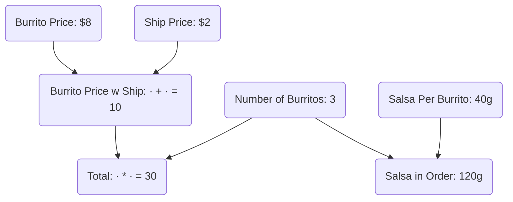
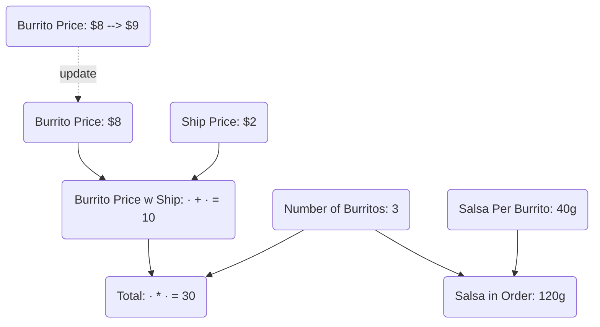
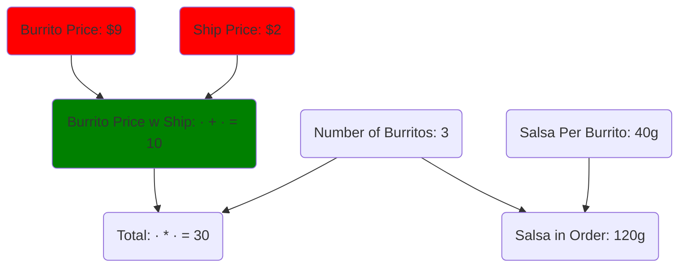
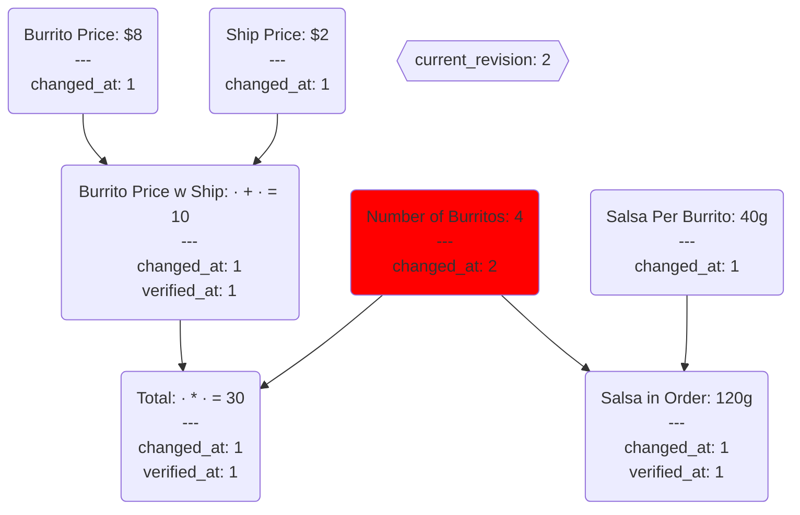
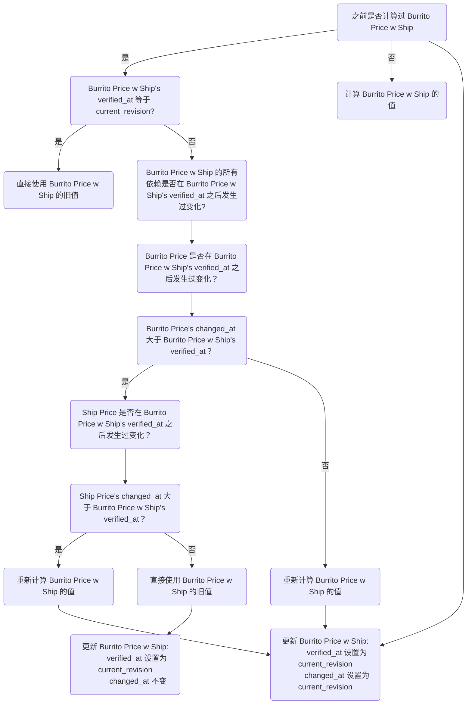
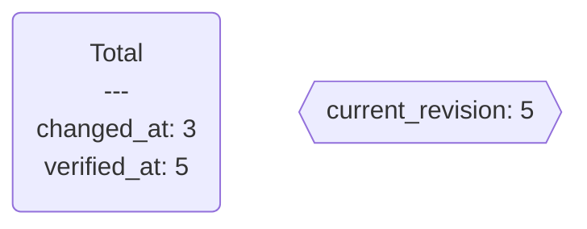
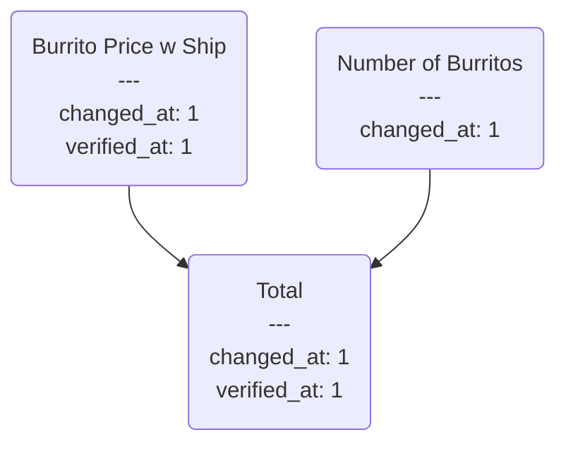
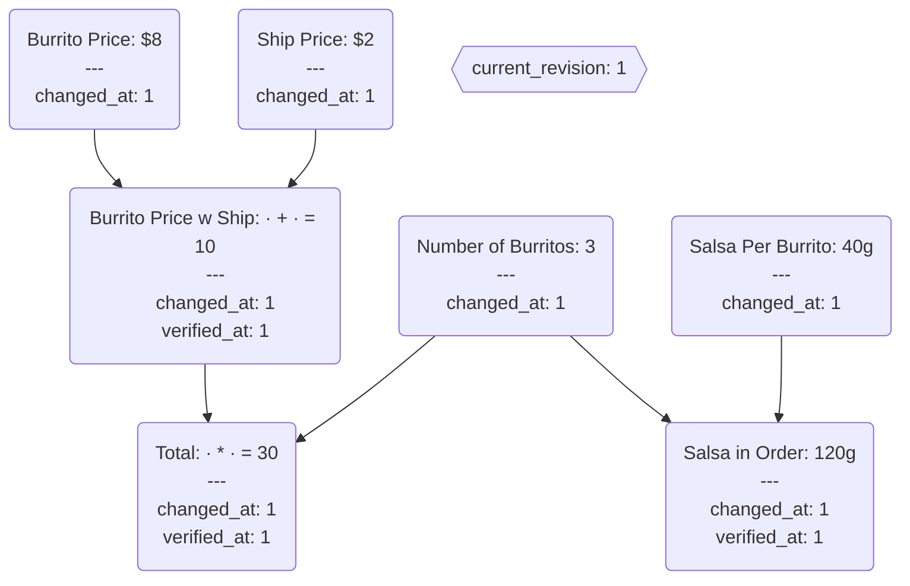
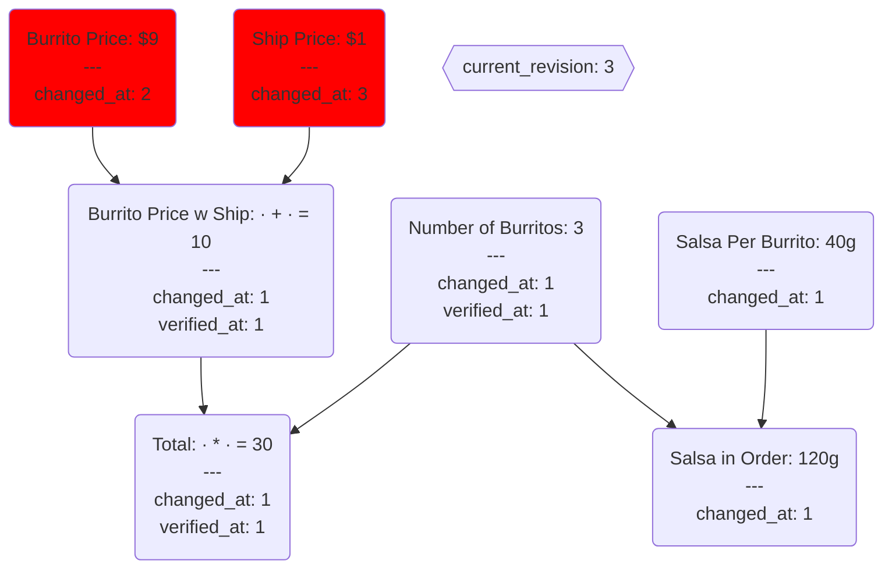
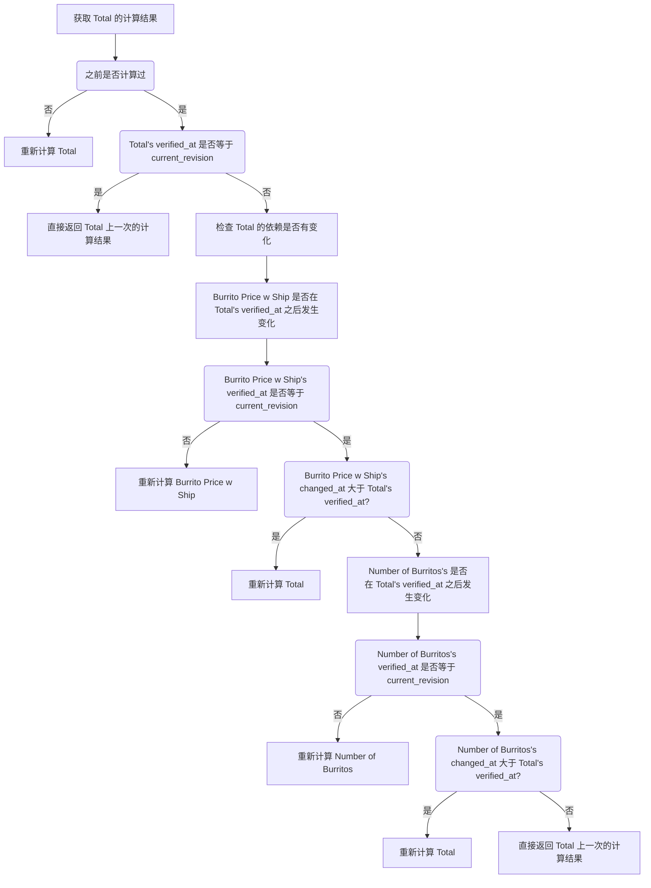

[Salsa](https://github.com/salsa-rs/salsa) 要解决的问题叫做“增量计算”（incremental computation），这个问题的核心是：在计算的时候，如何利用之前的计算结果，避免重复计算，从而加快计算速度。

下面来看一个例子，这个例子改编自 [How to Recalculate a Spreedsheet](https://lord.io/spreadsheets/)。

> 我一直好奇为啥这个库取名叫 Salsa，难道和这个例子有什么关系？

上图描述了计算之间的依赖关系，现在假设 Burrito Price 从 $8 变成了 $9，Ship Price 从 $2 变成了 $1，那么我们需要重新计算哪些值呢？

理想情况下，我们只需要重新计算 Burrito Price w Ship，而 total 虽然间接依赖了 Burrito Price，但它直接依赖的 Burrito Price w Ship 并没有发生变化，所以不需要重新计算 total。当然，Salsa in Order 也不需要重新计算。

<!-- ## Demand-driven Computation

我们把上图中的节点分为两类：输入节点和计算节点。输入节点的值是外部输入的，计算节点的值是根据其他节点的值计算出来的。上面这个例子中，Burrito Price、Ship Price 和 Number of Burritos 是输入节点，其他节点都是计算节点。

当有输入节点的值发生变化时，只重新计算受影响的计算节点，这就是 Salsa 要做的事情吗？

大体是这样，但 Salsa 还有另外一个特点：demand-driven computation。这个词翻译成中文叫“需求驱动计算”，这个词的意思是：当一个计算节点的值被需要的时候，才计算这个节点的值。或者可以叫做 lazy computation （惰性计算）。举个例子，假设 Burrito Price 变化了，Salsa 并不会立刻计算并更新 Burrito Price w Ship 的值和 Total 的值，如果现在没有任何代码需要用到这两个值，那么 Salsa 会等到有代码需要用到这两个值的时候，才计算并更新这两个值。

从计算图的角度来看，Salsa 的计算是自底向上的，计算一个节点的值之前，先计算这个节点的所有父节点的值。 -->

## How Salsa Works

上述计算的问题可以抽象为一个有向无环图（DAG），节点表示输入或计算，边表示依赖关系。

Salsa 引入了一个概念：revision。我们把整个计算问题视作一个系统，系统的 revision 从 1 开始，每次有输入节点的值发生变化，revision 就会加 1，我们把这个 revision 叫做 `current_revision`。每个节点都有一个 `revision`，表示上次该节点的值发生变化时系统的 revision，我们把这个 revision 叫做 `changed_at`。计算节点还有一个 revision，用来表示该节点的值在哪个 revision 被验证过是有效的，我们把这个 revision 叫做 `verified_at`。

<!-- `changed_at` 和 `verified_at` 配合起来，可以用来判断一个节点的旧值是否可以重用，那它们是如何配合起来工作的呢？我们来看一个例子。 -->

当一个节点的 `verified_at` 小于 `current_revision` 时，表示该节点的旧值**可能**已经过时，不能直接使用。注意这里的“可能”，并不是说这种情况下旧值就一定过时了。

这里我们改变了 Number of Burritos 的值，current_revision 从 1 变成了 2，Number of Burritos 的 changed_at 也从 1 变成了 2。Burrito Price w Ship 的
`verified_at(1)` 小于 `current_revision(2)`，所以 Burrito Price w Ship 的旧值**可能**已经过时，不能直接使用。但是从图上，可以直观得出结论 Burrito Price w Ship 的旧值并没有过时，因为 Number of Burritos 的变化并不会影响 Burrito Price w Ship 的值。假设现在要获取 Burrito Price w Ship 的值，Salsa 会怎么做呢？

假设系统的状态如下，Total 的旧值能直接使用吗？

现在假设 Burrito Price 从 $8 变成了 $9，Ship Price 从 $2 变成了 $1，Salsa 是如何利用 revision 来实现增量计算的呢？

> 这里 `current_revision` 从 1 变成了 3，对于整个系统来说，Burrito Price 和 Ship Price 先后发生了变化，每次变化都会增加 `current_revision`，所以 `current_revision` 从 1 变成了 3。相应的，Burrito Price 和 Ship Price 的 `changed_at` 也从 1 变成了 2 和 3。

现在想要获取 Total 的值，流程如下：

