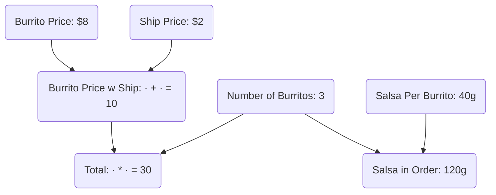
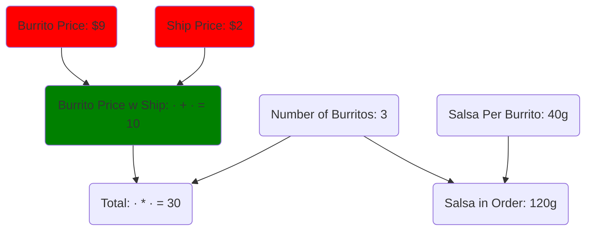
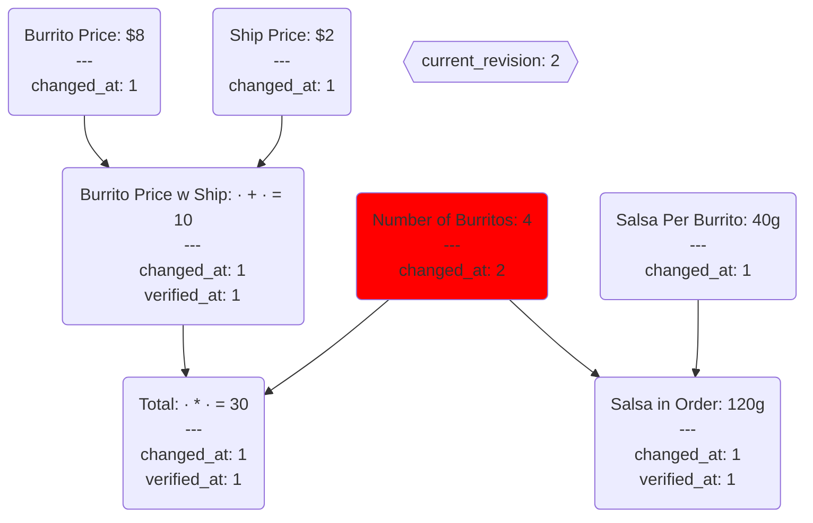
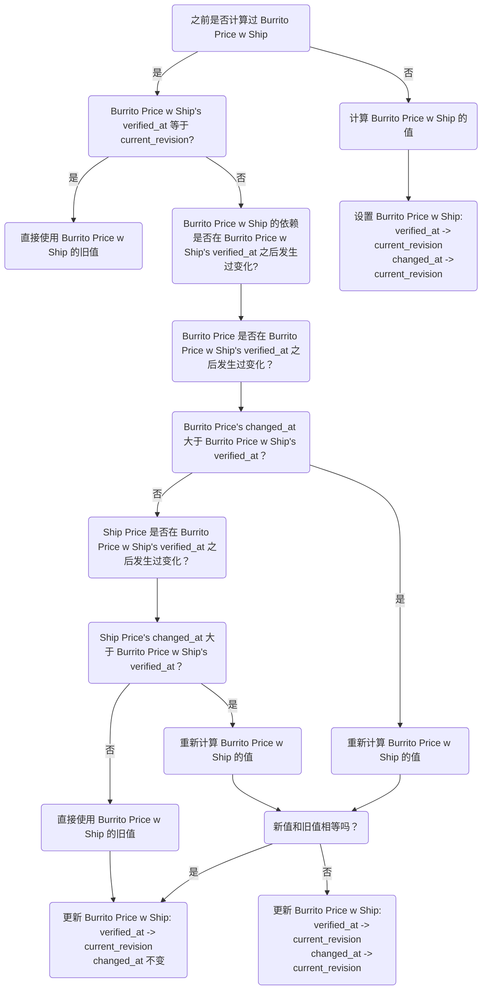
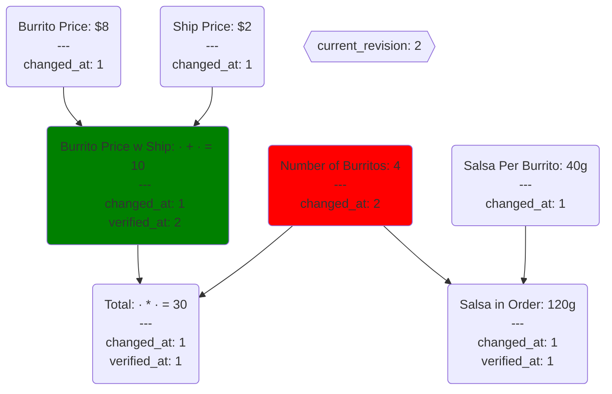
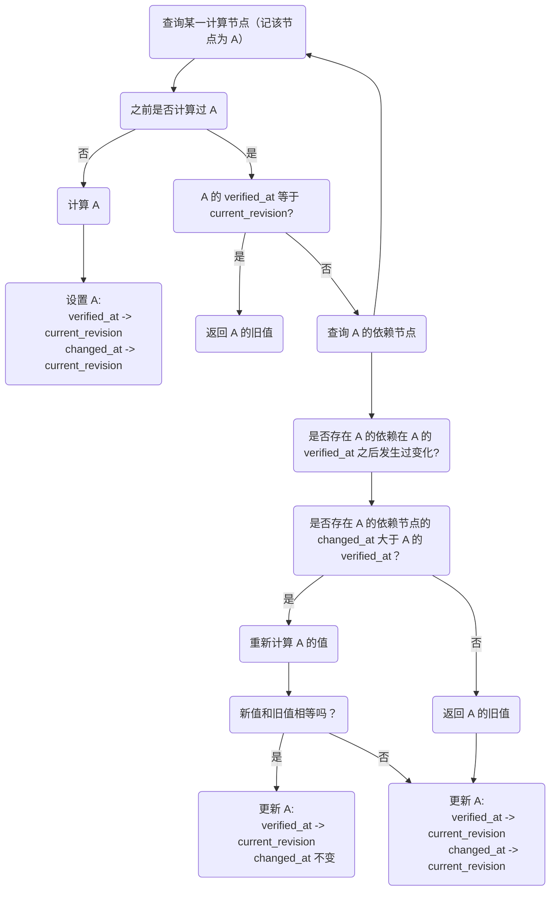

[Salsa](https://github.com/salsa-rs/salsa) 要解决的问题叫做“增量计算”（incremental computation），这个问题的核心是：在计算的时候，如何利用之前的计算结果，避免重复计算，从而加快计算速度。

下面来看一个例子，这个例子改编自 [How to Recalculate a Spreedsheet](https://lord.io/spreadsheets/)。

> 我一直好奇为啥这个库取名叫 Salsa，难道和这个例子有什么关系？但也没有其他的相关证据

上图描述了计算之间的依赖关系，现在假设 Burrito Price 从 $8 变成了 $9，Ship Price 从 $2 变成了 $1，那么我们需要重新计算哪些值呢？

理想情况下，我们只需要重新计算 Burrito Price w Ship，而 Total 虽然间接依赖了 Burrito Price，但它直接依赖的 Burrito Price w Ship 并没有发生变化，所以不需要重新计算 Total。当然，Salsa in Order 也不需要重新计算。

## How Salsa Works

上述计算的问题可以抽象为一个有向无环图（DAG），节点表示输入或计算，边表示依赖关系。

Salsa 引入了一个概念：revision。我们把整个计算问题视作一个系统，系统的 revision 从 1 开始，每次有**输入节点**的值发生变化，revision 就会加 1，我们把这个 revision 叫做 `current_revision`。每个节点都有一个 `revision`，表示该节点的值上次发生变化时系统的 revision，我们把这个 revision 叫做 `changed_at`。计算节点还有一个 revision，用来表示该节点的值在哪个 revision 被验证过是有效的，我们把这个 revision 叫做 `verified_at`。

当一个节点的 `verified_at` 小于 `current_revision` 时，表示该节点的旧值**可能**已经过时，不能直接使用。注意这里的“可能”，并不是说这种情况下旧值就一定过时了，比如说下面这种情况：

这里改变了 Number of Burritos 的值，Salsa 会把 current_revision 和 Number of Burritos 的 changed_at 从 1 变更为 2。Burrito Price w Ship 的
`verified_at(1)` 小于 `current_revision(2)`，所以 Burrito Price w Ship 的旧值**可能**已经过时，不能直接使用。但是从图上，可以直观得出结论 Burrito Price w Ship 的旧值并没有过时，因为 Number of Burritos 的变化并不会影响 Burrito Price w Ship 的值。假设现在要获取 Burrito Price w Ship 的值，Salsa 会怎么做呢？

> **NOTE**：如果需要重新计算的话，重新计算完 Burrito Price w Ship 的值后，需要比较新值和旧值是否相等，如果相等的话，就不需要改变 Burrito Price w Ship 的 `changed_at`。这一点很重要，Salsa 把它叫做 backdate，backdate 使 Salsa 能重用更多的计算结果。考虑之前的例子，如果同时改变 Burrito Price 和 Ship Price，Burrito Price 从 8 变成 9，Ship Price 从 2 变成 1，那么 Burrito Price w Ship 的值就不会改变，backdate 使得 Salsa 不用重新计算 Total 的值。（感兴趣的话可以根据上述流程图，自己推导一下）

查询 Burrito Price w Ship 的值后，整个系统的状态如下：

> **NOTE**：这里并没有更新 Total 这个节点，这是因为 Salsa 的计算是 **lazy** 的，只有当节点被查询时，才会计算它的值。这个特点也叫做 **demand-driven computation**。

把上述过程抽象出来，得到查询任一节点的流程：

## 参考资料

- [How to recalculate a spreadsheet](https://lord.io/spreadsheets/)
- [How Salsa works](https://salsa-rs.netlify.app/how_salsa_works.html)
- [The source code of Salsa](https://github.com/salsa-rs/salsa)
